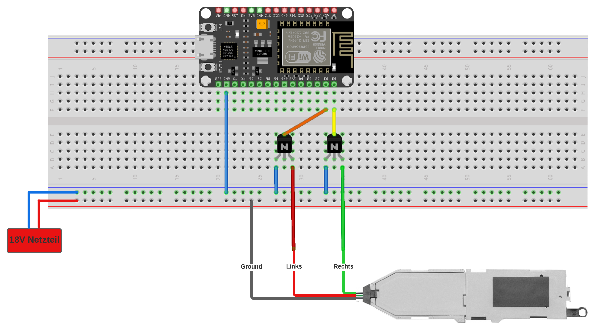

## Master-Slave-Prinzip
## Slaves im Echtzeitbetrieb
### ESP8266 mit RTOS <!--LE-->
### Master ohne EBS
## Komponenten
* MQTT Broker
* Achszähler (MQTT Client)
* Weichensteller (MQTT Client)
* Züge (Bus Client)
* Gleisbuscontroller (Bus Master)
* Leitstelle (MQTT Client)
* GUI
### Gleis-Bussystem
### Achszähler
### Weichenschaltung<!--NJ-->
Die Weichenschaltung bezeichnet den Aufbau, welcher die Weichen in die jeweiligen vorgegebenen Richtungen schaltet.
Über den angeschlossenen ESP8266 werden die Weichen über eine Transistorschaltung geschaltet.  

Die Standardweichen von Roco sind nicht mit Antrieben ausgestattet, wodurch es somit nicht möglich ist diese "out-of-the-box" direkt zu benutzen. Hierfür mussten
erst Weichenantriebe beschafft und eingebaut werden. Um das Konzept von verteilten Systemen umzusetzen, soll jede Weiche über ihren eigenen ESP verfügen und 
geschaltet werden (Dieser übernimmt gleichzeitig die Achszählung für die jeweilige Weiche). Die Weichenantriebe liegen in zwei ausführungen vor. Einmal digital und analog.
Da der ESP nicht über das gleiche Bussystem wie die Schienen verfügt, musste sich für die analoge Variante entschieden werden, da diese über den ESP schaltbar ist.

Jeder Antrieb verfügt über eine Spule, welche durch das Zuführen von Spannung die Richtung ändert und somit die Weiche über einen mechanischen Mechanismus stellt beziehungsweise
steuert. Ein ESP weist mit einer Ausgangsspannung von 3,3 Volt eine zu geringe Spannung vor und ist somit nicht in der lage die Weiche selbstständig (aus eigener Kraft) zu steuern.
Hierfür wurde eine Transistorschaltung entworfen, welche eine externe Spannungsquelle mit 18 Volt besitzt und nur über die 3,3 Volt des ESPs angesteuert wird. 



Wichtig bei dieser Schaltung ist, dass der Ground-Anschluss der Weiche auf das Plus des 18 Volt Netzteiles geschalten werden muss. Die zwei Kabel zum Schalten der Weiche werden
jeweils an den Collector des Transistors geschalten. Somit "fließt" der Strom erst durch die Weiche und die Spannung liegt dann an dem jeweiligen Transistor an und "wartet" bis
dieser die anliegende Spannung gegen Ground zieht.

### MQTT-Broker <!--CH-->
In der folgenden Tabelle werden alle im Projekt genutzten MQTT-Topics aufgeführt.
Daneben befindet sich die Zuordnung, welche Systemkomponente jeweils Sender und Empfänger der Nachricht ist.
Würde man die grafische Oberfläche auf einen eigenen Rechner auslagern, so müsste dieser zusätzlich alle aufgeführten Topics abonnieren.

| MQTT Topic | Sender           | Abonnent           | Payload        |
|------------|------------------|--------------------|----------------|
| sensor/1   | Weichenstation 3 | Leitstelle         | Achszählwert   |
| sensor/2   | Weichenstation 3 | Leitstelle         | Achszählwert   |
| sensor/3   | Weichenstation 3 | Leitstelle         | Achszählwert   |
| sensor/4   | Weichenstation 4 | Leitstelle         | Achszählwert   |
| sensor/5   | Weichenstation 4 | Leitstelle         | Achszählwert   |
| sensor/6   | Weichenstation 4 | Leitstelle         | Achszählwert   |
| sensor/7   | Weichenstation 5 | Leitstelle         | Achszählwert   |
| sensor/8   | Weichenstation 5 | Leitstelle         | Achszählwert   |
| sensor/9   | Weichenstation 5 | Leitstelle         | Achszählwert   |
| sensor/10  | Weichenstation 6 | Leitstelle         | Achszählwert   |
| sensor/11  | Weichenstation 6 | Leitstelle         | Achszählwert   |
| sensor/12  | Weichenstation 6 | Leitstelle         | Achszählwert   |
| sensor/13  | Weichenstation 1 | Leitstelle         | Achszählwert   |
| sensor/14  | Weichenstation 1 | Leitstelle         | Achszählwert   |
| sensor/15  | Weichenstation 2 | Leitstelle         | Achszählwert   |
| sensor/16  | Weichenstation 2 | Leitstelle         | Achszählwert   |
| actuator/1 | Leitstelle       | Weichenstation 1   | 'L' oder 'R'   |
| actuator/2 | Leitstelle       | Weichenstation 2   | 'L' oder 'R'   |
| actuator/3 | Leitstelle       | Weichenstation 3   | 'L' oder 'R'   |
| actuator/4 | Leitstelle       | Weichenstation 4   | 'L' oder 'R'   |
| actuator/5 | Leitstelle       | Weichenstation 5   | 'L' oder 'R'   |
| actuator/6 | Leitstelle       | Weichenstation 6   | 'L' oder 'R'   |
| cmd/start  | Leitstelle       | Gleisbuscontroller | ID der Lok / * |
| cmd/stop   | Leitstelle       | Gleisbuscontroller | ID der Lok / * |

### Leitstelle <!--CH-->
Die Leitstelle bezeichnet das zentrale Programm, welches in Abhängigkeit der eingehenden Daten Züge startet und stoppt, Weichen stellt und gegebenenfalls Fehler beziehungsweise Ausnahmezustände erkennt und darauf reagiert. Der Rechner, auf dem jenes Programm ausgeführt wird, kann ebenfalls als Leitstelle bezeichnet werden.

#### Initialisierung des Netzes
Implementiert werden soll ein Framework, welches nicht an den konkreten Modellaufbau gebunden ist. Das Gleisnetz muss also konfigurierbar sein.
Erst beim Starten der Anwendung soll dementsprechend das spezifische Gleisnetz im System registriert werden.

Dies geschieht in vier Phasen:
1. Initialisierung der vorerst losen Gleissektionen (Streckenabschnitte)
2. Initialisierung der Weichen
3. Initialisierung der Achszähler
4. Initialisierung der Züge

Bei der Registration einer Weiche werden jeweils die Gleissektionen am Eingang, sowie am linken und rechten Ausgang definiert.
Hat der Administrator die Konfiguration korrekt durchgeführt, sind anschließend alle Gleissektionen entsprechend dem Modell miteinander verbunden.

Da sowohl Weichen mit drei Achszählern als auch Weichen mit nur zwei Achszählern vorgesehen sind und sich daraus starke Einflüsse auf das Verhalten der entsprechenden Zustandsautomaten ergeben, werden diese inklusive ihrer Zustandsüberführungen gesondert initialisiert.

Zuletzt werden die Startzustände der Züge erfasst. Dazu zählen Bezeichnung, Bus-ID, Achszahl, Fahrtrichtung und die initiale Gleissektion.

#### Initialisierung des MQTT-Clients
Der MQTT-Client wird konfiguriert und verbindet sich mit dem Broker. Für jeden Sensor ist ein Topic ```sensor/<SensorId>``` vorgesehen - diese werden vom Client abonniert.
Ferner wird ein Callback hinterlegt, welcher die eingehenden Daten an den Zustandsautomaten weiterreicht.
Anschließend wird der Befehl gesendet, den Gleisbus in Betrieb zu nehmen.

#### Gleissektionsreservierungen
Programmatisch betrachtet fährt jeder Zug immer nur von Gleissektion zu Gleissektion.
Bei jedem solchen Übergang wird eine Anfrage zum Befahren der nachfolgenden Sektion generiert und geprüft.
Ist das Zielsegment belegt oder reserviert, werden gegebenenfalls existierende Ausweichsektionen geprüft.
Sind auch diese nicht verfügbar, wird der Zug gestoppt.

#### Behandlung von eingehenden Sensordaten
Aus Sicht der Leitstelle sind die Sensorstationen Black Boxes. Diese senden lediglich einen finalen Zählwert, sobald ein Zug sie vollständig durchquert hat.
Die ID des Sensors wird am Gleisnetz aufgelöst. Anhand der belegten und reservierten Gleissektionen wird ermittelt, welcher Zug die Freigabe zum Passieren besitzt.
Finden sich hier mehrere Kandidaten, muss ein Fehler aufgetreten sein, da immer nur ein Zug über diese Freigabe verfügen kann.

Der Zählwert wird mit der Achszahl des ermittelten Zuges verglichen. Wird eine Abweichung festgestellt, kann die zurückliegende Gleissektion nicht freigegeben werden.
Um Unfälle zu vermeiden und das erneute Ankoppeln eventuell verlorener oder entgleister Wagons zu ermöglichen, wird ein globaler Notstop ausgelöst.

Stimmt die Zählung hingegen mit der Erwartung überein, wird der Zustand des Gleisnetzes aktualisiert und gegebenenfalls die zurückliegende Gleissektion freigegeben.

#### Freigabe einer Gleissektion
Verlässt ein Zug mit korrekter Achszählung eine Gleissektion, wird diese für andere Züge wieder freigegeben.
Zeitgleich wird eine Überprüfung angestoßen, die alle als _wartend_ markierten Reservierungsanfragen mit der freigewordenen Sektion vergleicht.
Von allen Kandidaten wird derjenige mit der höchsten Zugpriorität zur Weiterfahrt freigegeben und gestartet.

### Grafische Ausgabe <!--CH-->
Auf einer grafischen Oberfläche sollen durch die Leitstelle folgende Informationen in Echtzeit dargestellt werden:
* Anordnung des Gleisnetzes (statisch)
* Stellung der jeweiligen Weichen
* Belegung und Reservierung der Gleissektionen inklusive Bezeichner der betreffenden Züge

Eine direkte Einflussnahme wie etwa das Umstellen einer Weiche ist hierbei nicht vorgesehen, da das System vollautomatisch arbeiten und reagieren soll.
Zu Testzwecken können Weichen jedoch über ein physisches Steuerpult manipuliert werden.