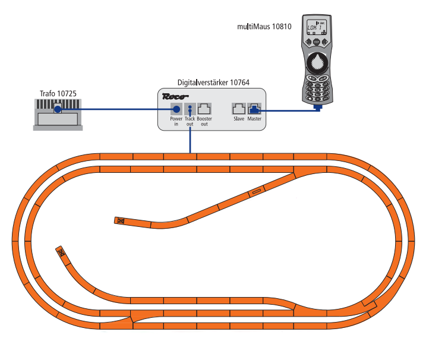
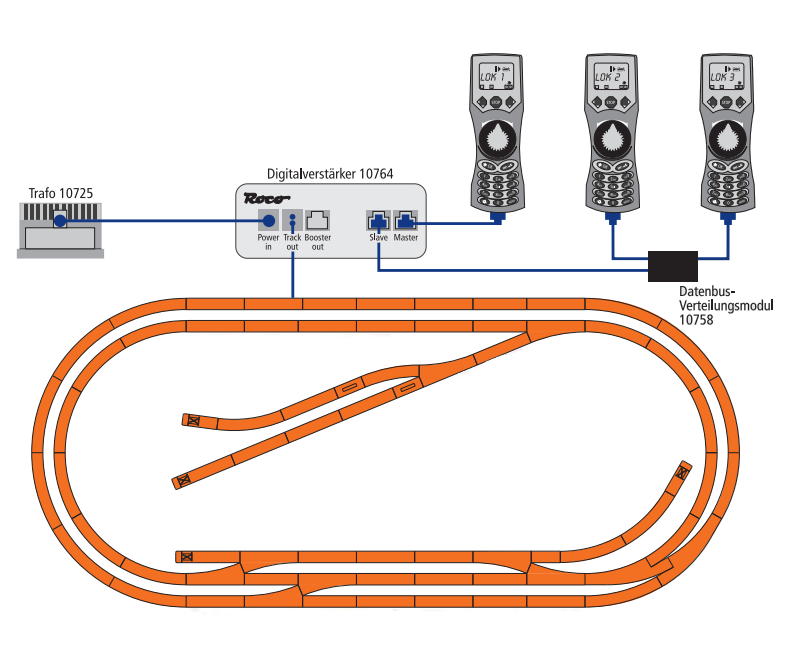
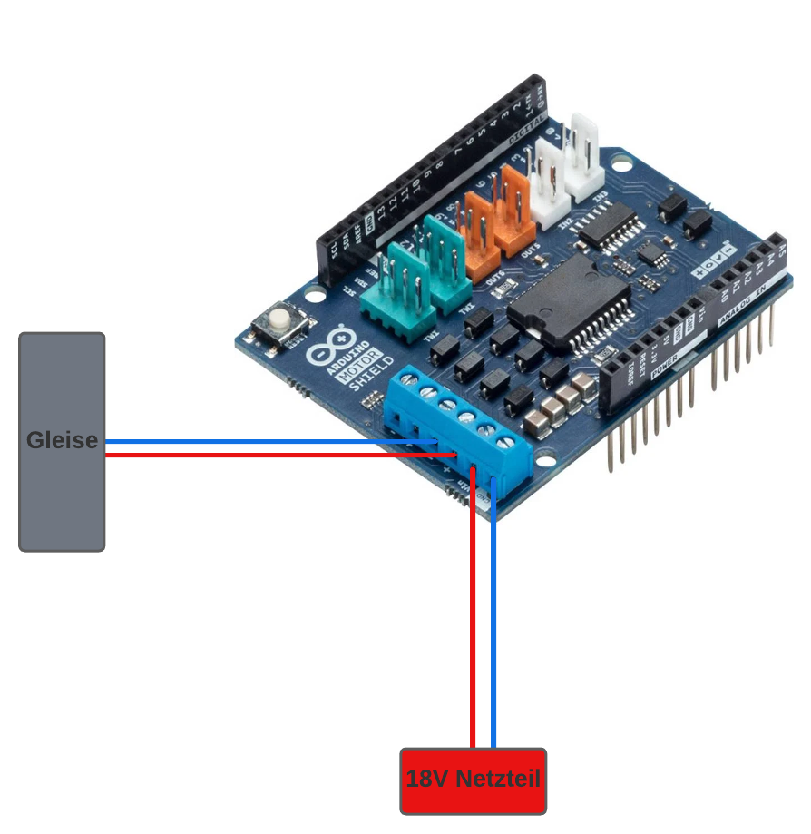
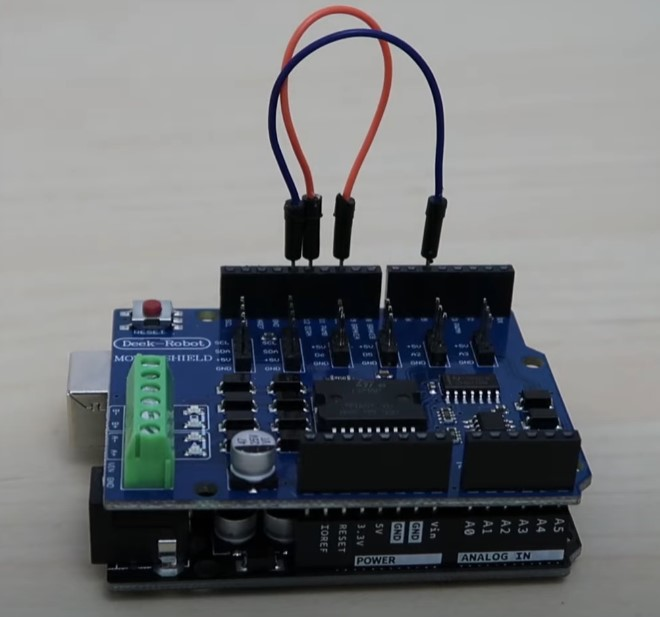
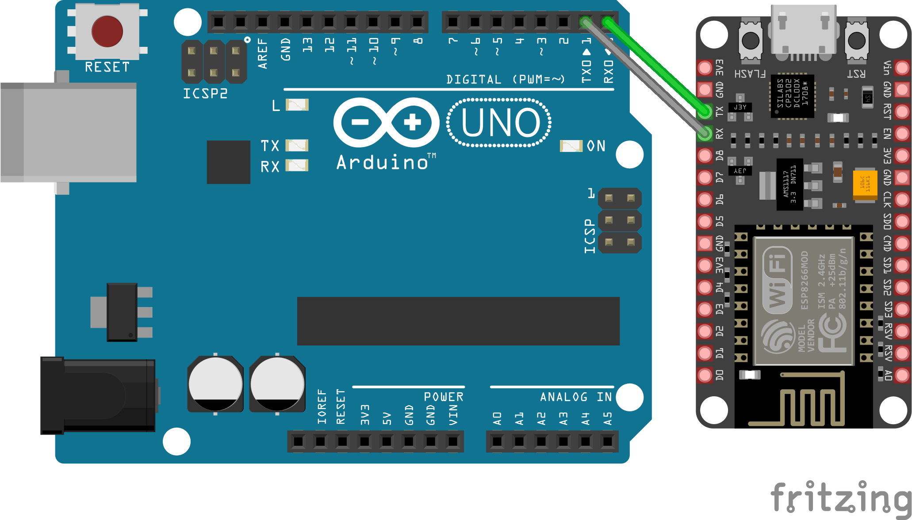

<!--AP-->
### Bussystem XpressNet
XpressNet ist vergleichbar mit einem Netzwerk gleich wie man es von Comuptern kennt. Es werden verschiedenen
Eingabegeräte mit der Zentrale der DCC-Steuerung verbunden. Bei den Eingabegeräten handelt es sich in der Regel um 
Bedienelemente oder USB/Ethernet-Interfaces an denen man beispielsweise einen Computer anschließen könnte. 

#### Übertragungstechnik des XpressNet
Die Übertragung erfolgt mittels RS485 in einer differentiellen Übertragungstechnik auf zwei Leitungen (Halbduplex),
welche an beiden Enden mit 120 Ohm abgeschlossen ist. In der Regel sitzt ein Abschluss in der Zentrale (Master). 

Die Quelle bei RS485 sendet immer mit mindestens 1,5V, wobei bei den Empfängern immer mindestens noch 200mV ankommen 
müssen. Es sind Linien- sowie Sternentopologien möglich, aber keine Ring- oder Netzstrukturen. 

Bei einer Übertragungsrate von 62500 Baud werden mit neun Bit und einem Stopbit übertragen.

#### Buszuteilung und Arbitrierung
Das Bustiming wird von der Zentrale vorgegeben und diese sendet eine Buszuteilung (Token) oder eine Nachricht und
schaltet dann fallweise die Busrichtung für eine bestimmte Zeit um. Jede Übertragung der zentrale beginnt mit einem 
"Callbyte", welches den Adressaten (Wert 1, ..., 31) der Nachricht enthält und 2 Bits, welche den Nachrichtentyp 
bezeichnen. In jeden "Callbyte" ist das achte Bit gesetzt, welche dem Client indiziert, dass es sich ab diesem Bit um den
Beginn der Nachricht handelt. (Nachricht an Client 0 == Brodcast Nachricht)

#### Probleme und Mängel
* Die Anzahl der Teilnehmer im Bus sind beschränkt
  * XpressNet kan nur max. 31 Busteilnehmer verwalten
* Adressraum im XpressNEt für Zubehördekoder ist auf 1024 beschränkt

### Grundaufbau mit Steuerung
Bei einem herkömmlichen Aufbau einer Modelleisenbahn von Roco wist der Aufbau wie folgt:

Der Digitalverstärker ist direkt über ein Kabel mit den Gleisen verbunden. Dieser bekommt von einem Netzteil seine 
Versorgungsspannung. Weiter ist an dem Digitalverstärker die Lokmaus angeschlossen. Sollte nur eine Lokmaus angeschlossen 
sein, dann muss diese in den Masterslot gesteckt werden. Hierbei ist dann die Lokmaus der Master und schickt die Befehle
an die Gleise. Sollte eine zweite Maus genutzt werden, dann muss diese den Slaveslot nutzen.

Nutzung von mehreren Lokmäusen:

### Grundplattform Arduino Uno und Motorshield
Für unseren Versuchsaufbau ist der normale Digitalverstärker und die Lokmaus untauglich, da diese nicht mit der 
uns zur Verfügung stehenden Hard- und Software kompatible sind.

Daher wurde sich als Grundlage für einen Arduino entschlossen, welcher im Zusammenspiel mit einem Motorshield die 
Steuerung der Eisenbahn übernimmt und das Bussystem bereitstellt. Das Motorshield stellt Anschlüsse zur Verfügung,
welcher der Arduino nicht besitzt, sowie von der Spannungslast nicht verträgt. Da auf den Gleisen eine Spannung von 
16 oder 18 Volt liegt, muss die Kommunikation zwangsweise über die Hauptanschlüsse des Motorshields laufen.

#### Zusammenbau Motorshield und Arduino
Um das Motorshield mit dem Arduino zu verbinden, muss dieses auf den Arduino gesteckt werden. Anschließend werden die
Pins 13 und 5 sowie 12 und 10.

#### Installation der DCC++ Library
Um die Grundlage zu schaffen, dass der Arduino mit den Dekodern in den Loks kommunizieren kann, muss zuerst die 
DCC++ Library von GitHub (https://github.com/DccPlusPlus/BaseStation) heruntergeladen und per Arduino IDE auf
den Arduino gespielt werden. Sollte der Arduino nun über Serial einen "Befehl" bekommen und dieser kompatibel mit der 
Befehlsstruktur der DCC++ Library ist, schickt dieser diesen über das Motorshield auf den Bus.

#### Internetverbindung des Arduinos
Da der Arduino Uno R3 kein eigenes WIFI-Modul besitzt, bekommt dieser einen ESP8266 an die Seite der diese Aufgabe übernimmt. 
Dieser sendet die per MQTT empfangenen Befehle per Serial an den Arduino mit dem Motorshield. Hierfür müssen die TX udn RX
Ports an dem Arduino mit den an dem ESP8266 verbunden werden.

### Beispiele Zugbefehle

#### Gleispannung an:
``
<p1>
``

#### Gleispannung aus:
``
<p0>
``

#### Zug mit der Adresse 1 fahren lassen:
``
<t 1 1 100 1>
``

#### Zug mit der Adresse 1 stoppen:
``
<t 1 1 0 1>
``